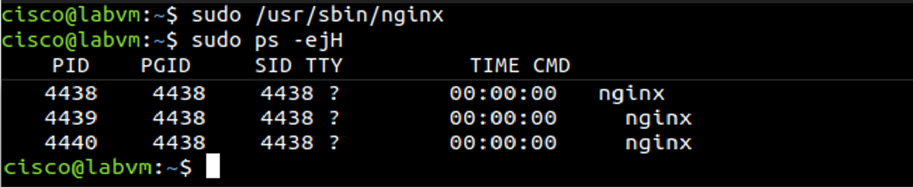
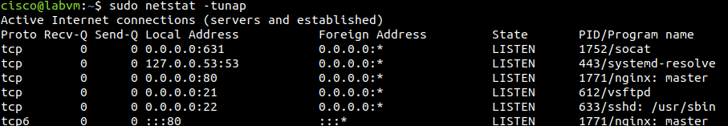
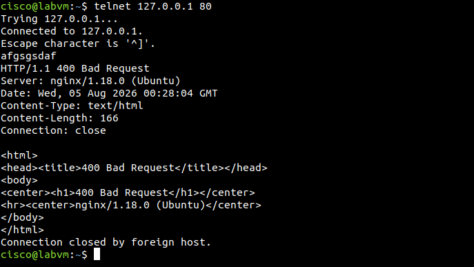
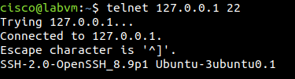

# Auditoría de Servicios Linux y Banner Grabbing de Sockets TCP

## 📝 Descripción
Este laboratorio práctico está enfocado en la administración de sistemas Linux y la auditoría de seguridad en capas de red y aplicación. Se realiza la inspección de procesos en segundo plano, la correlación entre sockets de red abiertos y sus respectivos PIDs de proceso, y la técnica de **Banner Grabbing** utilizando Telnet como cliente TCP genérico para fingerprinting de servicios web y de administración remota.

---

## 🎯 Objetivos
* Auditar y visualizar procesos activos del sistema y su jerarquía mediante comandos de la CLI de Linux.
* Identificar sockets de escucha (*LISTEN*) y conexiones de red asociando protocolos, puertos e IP locales con su PID de proceso.
* Realizar pruebas de conectividad manual en Capa 7 (Banner Grabbing) a servicios HTTP y SSH.
* Analizar el comportamiento de clientes TCP ante servicios basados en UDP.

---

## 🛠️ Tecnologías Utilizadas
| Tecnología / Herramienta | Función en el Laboratorio |
| :--- | :--- |
| **Linux (Ubuntu/Security Workstation)** | Sistema operativo base para el análisis |
| **Nginx (v1.18.0)** | Servidor web HTTP en puerto 80 |
| **OpenSSH (v8.9p1)** | Servidor de administración remota en puerto 22 |
| **ps** | Inspección y jerarquía de procesos del sistema |
| **netstat** | Auditoría de puertos y sockets de red |
| **telnet** | Cliente de red TCP para interacción directa y banner grabbing |

---

## 🔬 Desarrollo del Laboratorio

### Parte 1: Identificación y Correlación de Servicios y Procesos

1. **Gestión e inspección de procesos:**
   Se inició el daemon del servidor web Nginx con privilegios de superusuario:
   sudo /usr/sbin/nginx

   Luego, se inspeccionó el árbol de procesos para entender la jerarquía Master/Worker:
   sudo ps -ejH

2. **Auditoría de sockets de red:**
   Se utilizó la herramienta `netstat` con modificadores numéricos y de procesos para identificar qué puertos se encuentran a la escucha en el sistema:
   sudo netstat -tunap

3. **Correlación PID to Process:**
   Una vez identificado el socket en el puerto 80/TCP perteneciente al PID de Nginx, se filtró la tabla de procesos mediante `grep` para confirmar la ruta del ejecutable:
   sudo ps -elf | grep <PID>

---

### Parte 2: Pruebas de Servicios TCP y Banner Grabbing

1. **Fingerprinting en Puerto 80 (HTTP):**
   Se estableció una conexión TCP directa hacia el puerto 80 del host local mediante Telnet:
   telnet 127.0.0.1 80

   Al enviar una cadena de texto arbitraria (no conforme al protocolo HTTP), el servidor Nginx respondió con un encabezado de error `HTTP/1.1 400 Bad Request`, revelando la versión exacta del servidor en su cabecera `Server: nginx/1.18.0 (Ubuntu)`.

2. **Fingerprinting en Puerto 22 (SSH):**
   Se realizó la conexión manual al puerto 22:
   telnet 127.0.0.1 22

   A diferencia del servicio web, la pila SSH responde inmediatamente al Handshake inicial enviando la cabecera de versión del software: `SSH-2.0-OpenSSH_8.9p1`.

3. **Prueba de incompatibilidad sobre UDP (Puerto 68):**
   Se intentó establecer conexión hacia el puerto 68 (DHCP Client):
   telnet 127.0.0.1 68

   La conexión no pudo establecerse debido a que Telnet trabaja exclusivamente sobre el protocolo orientado a conexión **TCP**, mientras que DHCP utiliza datagramas **UDP**.

---

## 📷 Evidencias Técnicas

### 🖼️ Imagen 1 - Jerarquía de Procesos Nginx
Muestra la ejecución de Nginx y su estructura jerárquica con las opciones `-ejH`.

---

### 🖼️ Imagen 2 - Auditoría de Sockets con Netstat
Salida de `netstat -tunap` donde se correlaciona la dirección `0.0.0.0:80` en estado `LISTEN` con el proceso Nginx.

---

### 🖼️ Imagen 3 - Banner Grabbing HTTP (Puerto 80)
Respuesta de error 400 HTTP emitida por Nginx revelando la versión del servicio.

---

### 🖼️ Imagen 4 - Banner Grabbing SSH (Puerto 22)
Lectura directa del banner del servicio OpenSSH inmediatamente tras la conexión TCP.

---

## 🛠️ Comandos Utilizados y Justificación Técnica

| Comando | Parámetros | Propósito Técnico |
| :--- | :--- | :--- |
| `ps` | `-elf` | Muestra todos los procesos del sistema en formato detallado largo. |
| `ps` | `-ejH` | Muestra la jerarquía de procesos (relación Padre-Hijo/PPID) con sangrías. |
| `netstat` | `-tunap` | **-t:** TCP, **-u:** UDP, **-n:** Formato numérico (sin DNS), **-a:** Todos los sockets, **-p:** Muestra PID/Programa. |
| `telnet` | `<IP> <Puerto>` | Abre un socket TCP crudo contra una IP y puerto para probar conectividad y obtener información de capa 7 (Banner Grabbing). |

---

## 🔍 Verificaciones Realizadas
* **Confirmación de Seguridad:** Se verificó que el servicio Nginx corre su *Master Process* como `root`, pero delega el procesamiento de peticiones en un *Worker Process* bajo el usuario `http` sin privilegios, aplicando el **Principio de Menor Privilegio**.
* **Integridad de Red:** Se comprobó la correcta escuchabilidad de los puertos 22 (SSH), 80 (HTTP) y 21 (FTP).
* **Validación Protocolar:** Se confirmó la diferencia operativa entre protocolos orientados a conexión (TCP) y sin conexión (UDP) al interactuar con el puerto 68.

---

## 🧠 Conceptos Aprendidos
* **Fingerprinting / Banner Grabbing:** Técnica fundamental en fases de reconocimiento para identificar versiones de software vulnerables en sistemas remotos o locales.
* **Correlación Proceso-Socket:** Habilidad clave para analistas SOC al auditar máquinas comprometidas o detectar posibles troyanos/C2 que levanten puertos no autorizados.
* **Hardening de Servicios:** Identificación de fuga de información en cabeceras HTTP/SSH que podrían ser aprovechadas por un atacante durante la fase de reconocimiento.

---

## 💡 Posibles Mejoras de Seguridad / Buenas Prácticas
1. **Ocultar Banners de Versión (HTTP Hardening):** Configurar la directiva `server_tokens off;` en la configuración de Nginx (`nginx.conf`) para evitar exponer la versión exacta del sistema operativo y software.
2. **Uso de SSH en lugar de Telnet:** Reemplazar cualquier uso de Telnet para administración por **SSH**, ya que Telnet transmite credenciales e información en texto plano sin cifrar.
3. **Uso de Herramientas Modernas:** Emplear `ss` (Socket Statistics) como reemplazo moderno y más rápido de `netstat` en distros Linux actualizadas (`sudo ss -tulpn`).

---

## ❓ Preguntas de Reflexión

### 1. ¿Cuáles son las ventajas de utilizar netstat?
`netstat` brinda visibilidad inmediata del estado de la red a nivel del sistema operativo. Permite identificar puertos abiertos (LISTEN), detectar conexiones activas salientes o entrantes (ESTABLISHED) hacia direcciones IP desconocidas y asociar cada socket directamente con el PID del proceso ejecutable. Es una herramienta indispensable en tareas de triage de incidentes y auditoría de seguridad.

### 2. ¿Cuáles son las ventajas de utilizar Telnet? ¿Es seguro?
* **Ventajas:** Es una herramienta extremadamente liviana y útil para probar conectividad rápida a nivel de sockets TCP y para realizar *banner grabbing* manual en puertos de aplicación (Capa 7).
* **Seguridad:** **No es seguro** para tareas de administración remota. Transmite todo el tráfico (credenciales, comandos y datos) en texto plano (*unencrypted plain text*), haciendo que cualquier ataque de interceptación en la red (*Man-in-the-Middle*) comprometa por completo la sesión. Debe sustituirse siempre por protocolos cifrados como **SSH**.

---

## 📌 Conclusión
Este laboratorio permitió afianzar conceptos prácticos de auditoría de red y procesos en entornos Linux. Se demostró la importancia de correlacionar los servicios a la escucha con sus respectivos procesos en el sistema operativo y se validó operacionalmente cómo los banners de versión pueden exponer información crítica del sistema si no están configurados correctamente bajo mejores prácticas de hardening.
